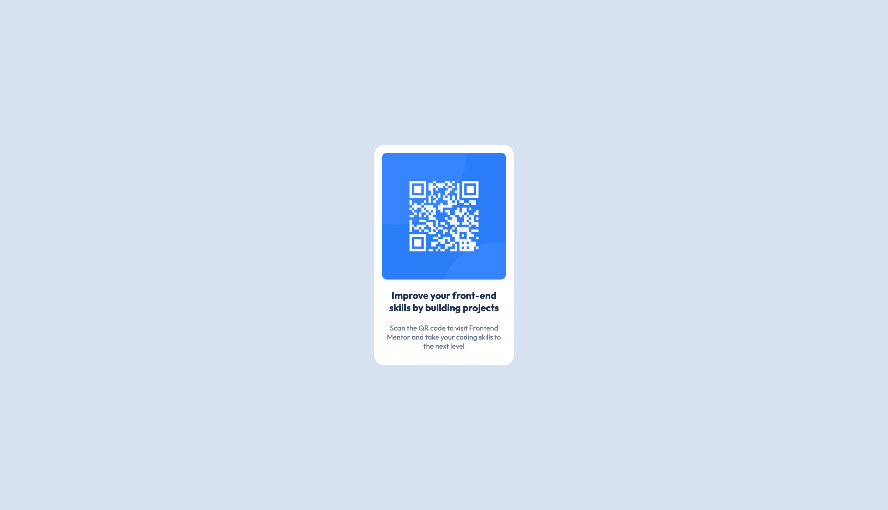

# Frontend Mentor - QR code component solution

This is a solution to the [QR code component challenge on Frontend Mentor](https://www.frontendmentor.io/challenges/qr-code-component-iux_sIO_H).

## Table of contents

- [Overview](#overview)
  - [Screenshot](#screenshot)
  - [Links](#links)
- [My process](#my-process)
  - [Built with](#built-with)
  - [What I learned](#what-i-learned)
  - [Useful resources](#useful-resources)
- [Author](#author)

**Note: Delete this note and update the table of contents based on what sections you keep.**

## Overview

### Screenshot

### Links

- Solution URL:- https://www.frontendmentor.io/solutions/qr-code-component-ublh60IVM0
- Live URL:- https://qrcode-cmp.netlify.app/

## My process

### Built with

- Semantic HTML5 markup
- External Links including google fonts
- CSS custom properties

### What I learned

To make the parent responsive as per it's children dimensions, we can give `css width: 'fit-content` and specify the required dimensions of the children eg. image element.

### Useful resources

- [MDN CSS](https://developer.mozilla.org/en-US/docs/Web/CSS) - This helped me in navigating through styling.

## Author

- Frontend Mentor - [@onkareshwarprasad17](https://www.frontendmentor.io/profile/onkareshwarprasad17)
